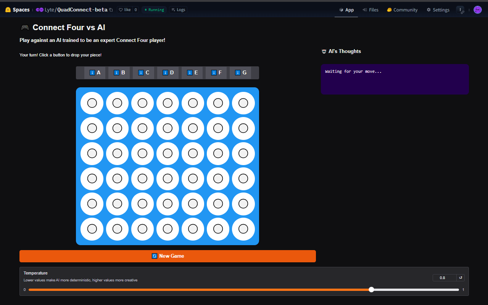

# QuadConnect - AI Powered Connect Four

[](https://huggingface.co/spaces/Lyte/QuadConnect-beta)
[](Lyte/QuadConnect2.5-0.5B-v0.0.9b)
[](https://github.com/yas19sin/QuadConnect)



## 📖 Introduction

QuadConnect is a project exploring the application of Large Language Models (LLMs) to strategic board games. This repository contains the code for training and deploying an AI opponent for Connect Four, built upon the **Qwen2.5-0.5B-Instruct** model and fine-tuned using **Group Relative Policy Optimization (GRPO)**. The goal was to move beyond traditional rule-based AI and investigate if an LLM could learn strategic reasoning and nuanced gameplay through reinforcement learning techniques.

This project was developed as a Portfolio Project for the [ALX Software Engineering program](https://tech.alxafrica.com/software-engineering-programme-casablanca).

**Key Links:**

* **Live Demo:** [Play Quad Connect on Hugging Face Spaces](https://huggingface.co/spaces/Lyte/QuadConnect-beta)
* **Model Card:** [Lyte/QuadConnect2.5-0.5B-v0.0.9b on Hugging Face](https://huggingface.co/Lyte/QuadConnect2.5-0.5B-v0.0.9b)
* **Project Blog Post:** [TBD]
* **Developer LinkedIn:** [LinkedIn](https://www.linkedin.com/in/ennaour/)

## ✨ Features

* **LLM-Powered Opponent:** Play against an AI driven by a fine-tuned Qwen2.5-0.5B model.
* **Strategic Training (GRPO):** The AI learns through reward functions designed to encourage winning, blocking, and strategic positioning.
* **Transparent Reasoning:** See the AI's thought process for each move it makes.
* **Web Interface:** Playable directly in your browser via a Gradio UI deployed on Hugging Face Spaces.

## 🛠️ Installation & Setup

To run the training or inference code locally:

1. **Clone the repository:**

    ```bash
    git clone https://github.com/yas19sin/QuadConnect.git
    cd QuadConnect
    ```

2. **Set up a Python environment:** (Recommended: use a virtual environment)

    ```bash
    python -m venv .venv
    source .venv/bin/activate # On Windows use `.venv\Scripts\activate`
    ```

3. **Install dependencies:** Ensure you have CUDA installed if using GPU acceleration.

    ```bash
    pip install -r requirements.txt
    ```

4. **Local Inference(`Optional`):** You can run local inference by either manually following the `Quick Start` instructions in the [Model Card](Lyte/QuadConnect2.5-0.5B-v0.0.9b) or cloning the [Hugging Face Space](https://huggingface.co/spaces/Lyte/QuadConnect-beta)

    ```bash
    # Clone repository
    git clone https://huggingface.co/spaces/Lyte/QuadConnect-beta
    cd QuadConnect-beta

    # Create and activate Python environment
    python -m venv env
    source env/bin/activate

    # Install dependencies and run
    pip install -r requirements.txt
    python app.py
    ```

## 🚀 Usage

### Training

The core training logic is within `quadconnect.ipynb` and `quadconnect.py`. You can run the cells in a Jupyter environment (like VS Code, Jupyter Lab, or Google Colab/Kaggle with appropriate GPU resources) or if you have a GPU with 12GB VRAM or more you can run it locally.

* Don't forget to add your Huggingface Access token if you plan on pushing the model to Hugging Face
* Modify parameters like `model_name`, `max_seq_length`, `lora_rank`, `training_args` as needed.
* Ensure you have access to the training dataset (`Lyte/ConnectFour-Training-Data_v3` or similar).
* Run the training cell: `trainer.train()`.
* Trained LoRA adapters and merged models can be saved and pushed to the Hugging Face Hub using the provided code cells.

### Inference (Python Script Example)

See the "Quick Start" section in the initial part of this README for an example using the `transformers` pipeline.

### Web Demo

Visit the deployed Hugging Face Space: [Quad Connect Demo](https://huggingface.co/spaces/Lyte/QuadConnect-beta)

## 🤝 Contributing

This was primarily a solo project for the ALX program. However, contributions, suggestions, and bug reports are welcome! Please feel free to open an issue or submit a pull request on the [GitHub repository](https://github.com/yas19sin/QuadConnect).

## 💡 Related Projects

* **Base Model:** [Qwen/Qwen2.5-0.5B-Instruct](https://huggingface.co/Qwen/Qwen2.5-0.5B-Instruct)
* **Optimization:** [Unsloth AI](https://github.com/unslothai/unsloth)
* **Training Framework:** [Hugging Face TRL](https://github.com/huggingface/trl)
* **Dataset Inspiration:** [Leon-LLM/Connect-Four-Datasets-Collection](https://huggingface.co/datasets/Leon-LLM/Connect-Four-Datasets-Collection)

## 📜 Licensing

The code in this repository is licensed under the [MIT License](https://opensource.org/license/mit).
The fine-tuned model weights inherit the license of the base Qwen 2.5 model. Please refer to its specific license for usage details.

## 🧠 The Story & Technical Deep Dive (Optional Task 6)

### Development Journey

My journey developing QuadConnect represents an exploration into reinforcement learning applied to strategic games, combining my interest in AI with RL through GRPO.

**Inspiration Revisited:** The spark for QuadConnect came from an intersection of passion and curiosity. As a student in the ALX Software Engineering program, I wanted my portfolio project to showcase both technical skills and creative problem-solving. Connect Four presented the perfect challenge: a game simple enough for humans to understand yet complex enough to test an AI's strategic reasoning. Traditional game AI relies on tree search algorithms like Minimax, but I was fascinated by a different question: could an LLM learn to play strategically through reinforcement learning, without being explicitly programmed with game rules?

**The GRPO Challenge:** Implementing Group Relative Policy Optimization wasn't just about using the library. The real work lay in crafting the reward functions. My initial attempts used simplistic rewards that only considered win/loss outcomes, resulting in an AI that recognized winning positions but lacked strategic depth. The breakthrough came when I developed `strategic_winning_reward_func` which evaluates multiple aspects of gameplay. This evolved into a sophisticated evaluation system considering:

* Game stage-specific strategies (early, mid, and late game)
* Threat detection and creation
* Blocking opponent's winning paths
* Setting up connected structures
* Creating "trap" positions that force opponent errors

The most challenging aspect was balancing these elements dynamically as the game progressed.

**Data Hurdles:** The format of game data for an LLM is crucial because structured and well-formatted data enables the model to understand context, spatial relationships, and the rules of the game more effectively. Simply listing moves like "a1, b1, c1" proved inadequate, as the model struggled to interpret the board state and make strategic decisions. The evolution to dataset v3 included critical improvements:

* Representing the board as coordinate lists like "a1(X), b1(O)"
* Including "Next available position per column" to help the model understand valid moves
* Structuring prompts to emphasize player identity and game state
* Using XML format tags to enforce consistent response structure

This reformatting dramatically improved the model's ability to make legal moves and develop coherent strategies.

**Why Qwen 2.5 0.5B?**

Due to imposed limitations like time, compute, and such, a model of smaller size is preferred for faster prototyping. Compared to larger models like Qwen/Qwen2.5-1.5B-Instruct or even Llama-based models, Qwen 2.5 0.5B strikes a balance between performance and resource efficiency, making it ideal for rapid experimentation and iteration. Additionally, the model selection can be easily scaled up later to larger variants without requiring significant code modifications, ensuring flexibility for future improvements.

**Overcoming Challenges:** The persistent negative validity reward, which penalizes the model for generating invalid moves or responses, required significant debugging. This issue arose because the model would consistently respond in incorrect formats or make illegal moves, hindering its ability to play the game effectively. By implementing strict format validation through `strict_move_format_reward_func` and `xml_count_reward_func`, I was able to dramatically improve the model's compliance with game rules. Managing scope meant making the critical decision to focus on "competent" play rather than "expert" AI. Rather than pursuing perfect play that would require massive compute resources, I oriented my reward functions toward making the game enjoyable and challenging for human players. Although the current model is barely trained on 250 steps so far and requires at least a minimum of 1000-2000 and up to 5000 steps.

**Future Vision:** While the current AI is not yet playable, the next steps could involve scaling to larger models like Qwen2.5-1.5B or even 7B variants for more sophisticated play. The UI could be enhanced with a Unity-based interface for better graphics and user experience. On the technical side, a 2 stage finetuning plan is required for better task adherence and intelligence:

1. **Stage 1 - Domain/Task Knowledge Finetuning:** This stage involves training the model on a curated dataset specific to Connect Four (or any other task) to ensure it understands the rules, strategies, and nuances of the game. This provides the model with a strong foundation of domain knowledge.
2. **Stage 2 - GRPO (Reinforcement Learning) Finetuning:** In this stage, the model is fine-tuned using Group Relative Policy Optimization (GRPO) to enhance its strategic reasoning and decision-making capabilities, resulting in significant performance improvements.

This project laid the groundwork for my continuing interest in reinforcement learning for game AI, demonstrating that even small language models can learn strategic reasoning when properly guided through well-designed reward systems.
